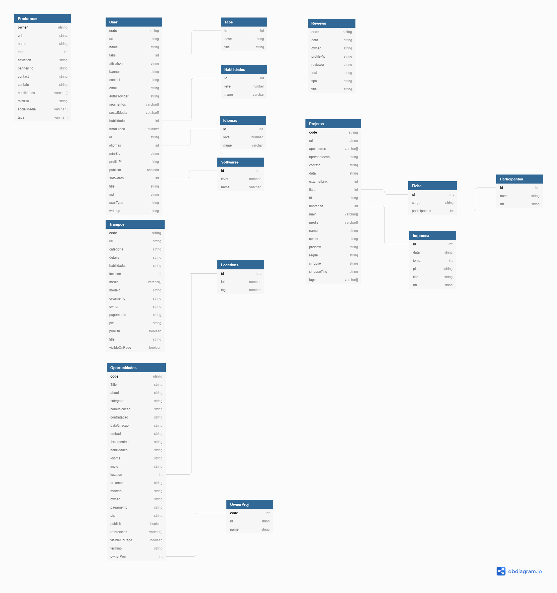

# Freebird

<!---Esses são exemplos. Veja https://shields.io para outras pessoas ou para personalizar este conjunto de escudos. Você pode querer incluir dependências, status do projeto e informações de licença aqui--->


>Ferramenta Open Source para fomentar empresas, ecossistemas, organizações e associações da Indústria Criativa. Cada usuário tem liberdade para executar, acessar, modificar e desenvolver o código fonte para ser implementado em ecossistemas criativos.

## Implementações

* Implementação em ReactJS, Charka UI, React-Query e Firebase.

### Ajustes e melhorias

Roadmap:

- [x] Arquitetura MVC em Blazor
- [x] Back end .NetCore
- [x] Back end NoSQL - Implementado no Firebase, extensível para qualquer opção. 
- [x] Modificação para MicroServiços
- [x] Habilitação da API em .NetCore
- [X] Habilitação de plugins de Front-End em React
- [ ] Explicação do sistema de plugins para facilitar a customização

## 💻 Pré-requisitos
<!---Estes são apenas requisitos de exemplo. Adicionar, duplicar ou remover conforme necessário--->
* NodeJS Instalado
* NPM configurado

## 🚀 Instalando o Freebird

Para instalar o Freebird, siga estas etapas:

### Maps API
* Primeiro obtenha uma chave da API grátis do [Google Maps](https://developers.google.com/maps/documentation)
* Crie um arquivo chamado apenas `.env`.env no diretório raiz.
* Coloque o seguinte conteúdo:
```
# .env file
#
# Add environment-specific variables on new lines in the form of NAME=VALUE
# 
REACT_APP_API_GOOGLE_API=GOOGLEAPI
```
* Modifique a chave GOOGLEAPI para utilizar a chave obtida pelo google

### Firebase
* Use o serviço de database de sua preferência, recomendamos o serviço [Firebase](https://firebase.google.com/docs/web/setup?hl=pt-br) pela facilidade de uso.
* Vá até o arquivo utils/firebase.js e encontre o objeto `firebaseConfig`
* Siga o [Guia](https://firebase.google.com/docs/web/setup?hl=pt-br) para a habilitação de um projeto no Firebase. Substitua o firebaseConfig pelo fornecido durante o seguinte [passo](https://firebase.google.com/docs/web/learn-more#config-object).
* Abra o command prompt na pasta raiz do projeto e rode o comando `npm install`

### Publicação.

* O freebird-api se utiliza da tecnologia serverless, não é necessário qualquer server para roda-lo. Localmente é necessário algum servidor como o NodeJS para funcionar devido à políticas de segurança de browser.
* Não é necessário um server para rodar o projeto, ou o backend, após configurado de acordo com os passos acima ele já está pronto para a publicação.
* A forma mais fácil de publicar é subir o projeto pra um repositório do github e seguir os passos do serviço [Vercel](https://vercel.com/guides/deploying-react-with-vercel)
* Em minutos você pode ter um site próprio funcionando.

## ☕ Usando o Freebird

Caso esteja usando o Firebase, nenhuma configuração extra é necessária:

* Abra um command prompt na pasta raiz do projeto.
* `npm start` incia um servidor de desenvolvimento. 
* Os componentes para edição estão na pasta `Components`.
* Assim que possível disponibilizaremos um guia para a fácil edição utilizando plugins.
* Caso queira utilizar outro tipo de database, a pasta `hooks` possui os hooks utilizados para buscar informações da database.

## 📫 Contribuindo para o Freebird
<!---Se o seu README for longo ou se você tiver algum processo ou etapas específicas que deseja que os contribuidores sigam, considere a criação de um arquivo CONTRIBUTING.md separado--->
Para contribuir com o Freebird, entre no Discord e siga estas etapas:

1. Bifurque este repositório.
2. Crie um branch: `git checkout -b <nome_branch>`.
3. Faça suas alterações e confirme-as: `git commit -m '<mensagem_commit>'`
4. Envie para o branch original: `git push origin <nome_do_projeto> / <local>`
5. Crie a solicitação de pull.

Como alternativa, consulte a documentação do GitHub em [como criar uma solicitação pull](https://help.github.com/en/github/collaborating-with-issues-and-pull-requests/creating-a-pull-request).

## 🤝 Colaboradores

Agradecemos às seguintes pessoas que contribuíram para este projeto:

<table>
  <tr>
    <td align="center">
      <a href="https://github.com/c0nundrum">
        <br>
        <sub>
          <b>Danilo Ribeiro</b>
        </sub>
      </a>
    </td>
    <td align="center">
      <a href="https://github.com/enirya">
        <br>
        <sub>
          <b>Tayrine Lopes</b>
        </sub>
      </a>
    </td>
    <td align="center">
      <a href="https://github.com/fabricciocanhete">
        <br>
        <sub>
          <b>Fabriccio Canhete</b>
        </sub>
      </a>
    </td>
  </tr>
</table>

## Database Schema



## Agradecimentos


## 📝 Licença

Esse projeto está sob licença. Veja o arquivo [LICENÇA](LICENSE.md) para mais detalhes.

[⬆ Voltar ao topo](#freebird)<br>
